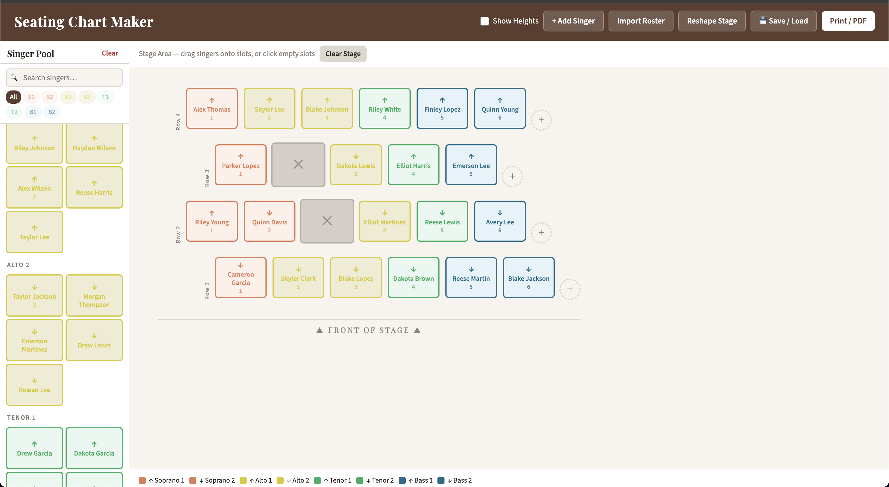

# kingstenlin.github.io

A lightweight webapp for creating choral seating charts.

👉 https://kingstenlin.github.io



## About

This site serves as a simple tool for the production of seating charts, particularly designed with choirs in mind.
- Drag and drop functionality
- Grey out tiles to show gaps
- Automatic chair numbering
- Optional height display
- Import rosters from a spreadsheet
- Save configurations to be used later
- Search for particular names
- Filter for parts
- Automatic PDF formatting for oversized configurations

The repository is structured to directly support deployment via GitHub Pages.

## Access

- Live site: https://kingstenlin.github.io  
- Updates are reflected automatically upon pushing to the default branch.

## Structure
```text
/
├── exampleRoster.xlsx # An example of the required excel format
└── index.html         # Entry point
```
## Development

This project is designed to be lightweight and directly viewable. Tech stack is HTML, CSS, and JS.

To run locally:

```bash
git clone https://github.com/kingstenlin/kingstenlin.github.io.git
cd kingstenlin.github.io
open index.html

```

## Deployment

No manual deployment required.

Pushing to the main branch updates the live site automatically via GitHub Pages.

## Future Work

- Implement local storage / possibly backend
- Improve UI / UX  
- Non-rectangular configurations?
